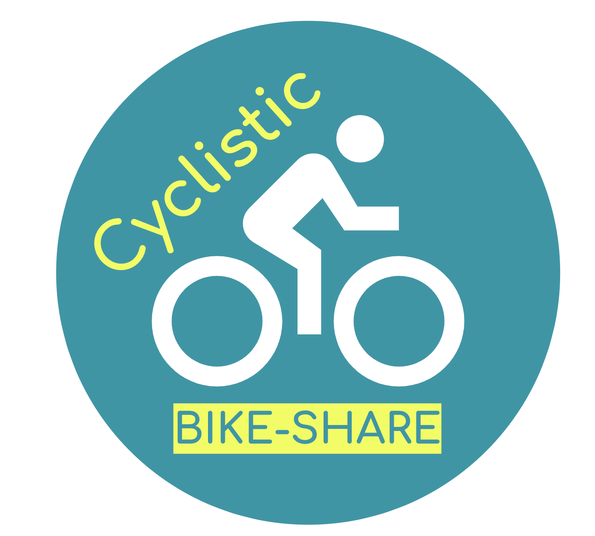

Cyclistic Bike-Share Analysis
================

## Introduction

This repository contains the analysis of Cyclistic, a fictional
bike-share company based in Chicago, aimed at uncovering insights to
convert casual riders into annual members. The project follows an
approach, utilizing data manipulation, visualization, and analysis
techniques in R to explore the differences in usage patterns between
casual riders and annual members.

The goal of this project is to develop a marketing strategy to increase
the conversion of current casual riders to annual members. By analyzing
Cyclistic’s bike trip data, we aim to understand how different user
types use the service and identify opportunities to encourage casual
riders to purchase annual memberships.

## Data Source

The analysis is based on Cyclistic’s trip data, which includes
information about each ride made with the service over the past year.
The dataset covers various aspects of the rides, such as start and end
times, station names, ride length, and user type (casual or member). The
data was provided as part of the Google Data Analytics Professional
Certificate capstone project. You can download the data
[here](https://divvy-tripdata.s3.amazonaws.com/index.html).

## Methodology

- Data Preparation: The R scripts include steps for loading, cleaning,
  and preparing the data for analysis. This involves merging multiple
  CSV files, handling missing values, and creating new variables for
  analysis.
- Data Analysis: Using tidyverse and other R packages, we conducted an
  exploratory data analysis to compare ride behaviors between casual
  riders and members. Key metrics include ride length, frequency, and
  patterns related to time of day, day of the week, and month.
- Visualization: The project utilizes ggplot2 for data visualization,
  providing insights into ride patterns and helping to identify trends
  that differentiate casual riders from annual members. A static map
  visualizes station locations to understand geographic trends.

## Key Findings

- Casual riders tend to use the service more on weekends and for longer
  rides, suggesting leisure use.
- Annual members consistently use the service for shorter, more frequent
  rides, indicating commuting or routine travel. -Seasonality affects
  usage patterns, with higher activity during warmer months.
- A small portion of rides are significantly longer than most,
  especially with docked bikes, pointing to potential outliers or data
  recording errors.

## Recommendations

1.  Introduce flexible membership options that would cater towards
    current casual riders. A tier membership system that would allow for
    weekend riders to subscribe to “Weekend-only” or “Summer-Passes”
    could be more appealing.
2.  Introducing a tracking system that enables riders to monitor their
    distance and time could “gamify” the experience. It’s evident that
    casual riders pursue longer rides, so the capability to share
    notable achievements would not only foster a natural sense of
    competition but also a sense of community among our riders.
3.  We can further encourage a sense of community by rewarding casual
    riders who use Social Media to engage with our service. This can be
    done with promotional prices or free weekend trials for those who
    participate.
4.  Launch targeted marketing campaigns during seasonal peak times that
    promote weekend sales and memberships.
