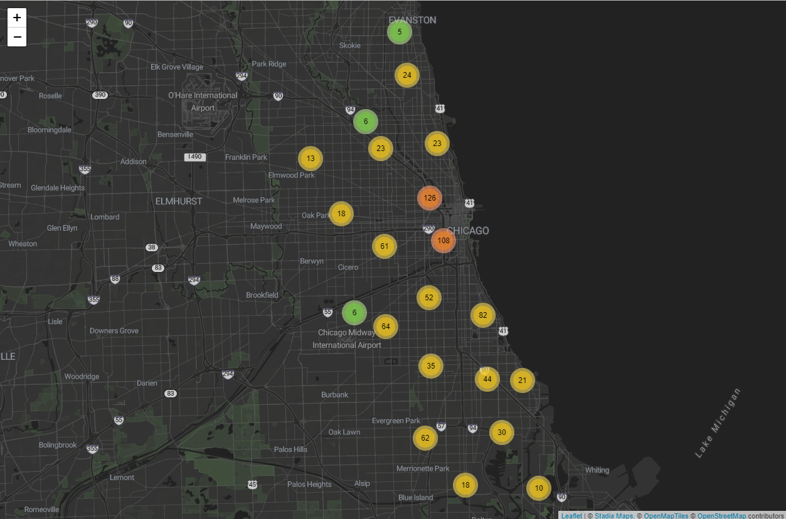

# Introduction
This case study utilizes data from a fictional company named Cyclistic as part of the capstone project from the Google Data Analytics Course. The goal is to uncover insights into the bike-sharing habits of Cyclistic's riders, which will inform a marketing strategy based on data-informed decisions. The analysis specifically aims to understand different usage patterns between casual riders and members, with the ultimate goal of converting the former into subscribing members.


# Data Preparation

### Load Libraries
```{r Loading Libraries}
library(geosphere)
library(leaflet)
library(leaflet.extras)
library(knitr)
library(tidyverse)
theme_set(theme_bw())
```


### Import Data
Load all the trip files into a list.
```{r echo=TRUE}
triplist <- list.files(pattern = "*.csv")
triplist

```

Import the data.
```{r echo=TRUE, message==FALSE}
all_trips <- map(triplist, ~read_csv(.x, show_col_types = F))
```


Evaluate the data structure before merging the list.
```{r echo=TRUE, results='hide'}
glimpse(all_trips)
```


Combining data into a single data frame.
```{r}
all_trips <- bind_rows(all_trips)
```


### Verify Data Structure
Verify ride_id is a unique primary key.
```{r}
anyDuplicated(all_trips$ride_id)
```


Re-evaluate structure.
```{r}
head(all_trips)
summary(all_trips)
str(all_trips)
```


# Data Wrangling
Extrapolation of dates.
```{r}
all_trips$date <- as.Date(all_trips$started_at)
all_trips$weekday <- weekdays(all_trips$started_at)
all_trips$month <- month(all_trips$started_at, label = T)
all_trips$year <- year(all_trips$started_at)
```


Convert weekday into a factor, ensuring days are analyzed in a logical sequence rather than alphabetically.
```{r}
all_trips$weekday <- ordered(all_trips$weekday,
                             levels = c("Monday","Tuesday","Wednesday","Thursday","Friday","Saturday","Sunday"))
```


Verify the class of our weekday variable.
```{r}
class(all_trips$weekday)
```


Calculate ride length.
```{r}
all_trips$ride_length_sec <- difftime(all_trips$ended_at, all_trips$started_at)
```


Convert ride_length_sec to numeric format
```{r}
all_trips$ride_length_sec <- as.numeric(all_trips$ride_length_sec)
```


### Addressing Missing Station Names
Identify the number of NA values in the dataset.
```{r}
colSums(is.na(all_trips))
```


Create two station lists (start stations and end stations)
```{r}
start_station_list <- all_trips %>%
  filter(!is.na(start_station_name)) %>% 
  distinct(start_station_id, start_lat, start_lng, .keep_all = T) %>%
  select(station_id = start_station_id,
         station_name = start_station_name,
         lat = start_lat,
         lng = start_lng)

end_station_list <- all_trips %>%
  filter(!is.na(end_station_name)) %>% 
  distinct(end_station_id, end_lat, end_lng, .keep_all = T) %>% 
  select(station_id = end_station_id,
         station_name = end_station_name,
         lat = end_lat,
         lng = end_lng)
```


Vertically bind rows to create one station list
```{r}
full_station_list <- bind_rows(start_station_list, end_station_list)
```


Filter stations where multiple station ids are associated with the same set of coordinates. Due to non-standardized naming conventions, some station names contain prefixes or variations of the same name. Station ids are not associated with different station names, just variations of the same name. In order to avoid a 'many-to-many' relationship error, the first instance is used in our new list.
```{r message=FALSE, warning=FALSE}
full_station_list <- full_station_list %>% 
  group_by(lat, lng) %>% 
  filter(n_distinct(station_id) == 1) %>% 
  summarize(station_id = first(station_id),
            station_name = first(station_name)) %>% 
  ungroup()
```


Join to our main data frame (all_trips) with our new station list.
```{r}
all_trips2 <- left_join(all_trips, full_station_list,
                        by = c("start_lat" = "lat",
                               "start_lng" = "lng"))
```


Move over recovered start station names and id's.
```{r}
all_trips2 <- all_trips2 %>%
  mutate(start_station_name = coalesce(start_station_name, station_name),
         start_station_id = coalesce(start_station_id, station_id)) %>% 
  select(-station_name, -station_id)
```


Do the same for the end station name's and id's.
```{r}
all_trips2 <- left_join(all_trips2, full_station_list,
                        by = c("end_lat" = "lat", "end_lng" = "lng"))

all_trips2 <- all_trips2 %>% 
  mutate(end_station_name = coalesce(end_station_name, station_name),
         end_station_id = coalesce(end_station_id, station_id)) %>% 
  select(-station_name, -station_id)
```


Recovered a couple hundred thousand station names and id's. Process was limited due to clustering of station coordinates.
```{r}
print(colSums(is.na(all_trips)))
print(colSums(is.na(all_trips2)))
```

### Identifying Extreme Outliers


Calculate the distance using the Haversine formula (Output is in meters). This is euclidean distance and is not a reflection of of road network distance.
```{r}
all_trips2 <- all_trips2 %>%
  rowwise() %>% 
  mutate(geo_distance_meters = distHaversine(c(start_lng, start_lat), c(end_lng, end_lat)))
```


Distribution of ride length.
```{r}
summary(all_trips2$ride_length_sec)
```


In-depth view considering there is such a large gap in the 4th quartile. Calculate percentiles for ride length in groups of 0.05.
```{r}
fourth_quar_ride_length <- quantile(all_trips2$ride_length_sec, probs = c(.80, .85, .90, .95, .99, .998, .999, 1))
fourth_quar_ride_length
```


The distribution is vast with great extremes, with a majority of outliers associated with the docked bikes. Perhaps this is an indication of an error occurring with docked bikes.
```{r}
ggplot(all_trips2, aes(x = ride_length_sec/3600, color = rideable_type)) +
  geom_boxplot(outlier.color = "darkred", alpha = 0.3) +
  labs(title = "Total Distribution of Ride Length (Split by Bike Type)",
       x = "Ride Length (Hours)") +
  annotate("Text", x = 312, y = 0.04, label = " Majority of Outliers", size = 5)
```


Most trips fall within a few hours or less, with the exception of docked bikes.
```{r warning=FALSE}
ggplot(all_trips2, aes(x = ride_length_sec/3600, fill = rideable_type)) +
  geom_histogram(binwidth = 10, color = "black") +
  labs(title = "Distribution of Ride Length (Split by Bike Type, Log10 scale)",
       x = "Ride Length (Hours)",
       y = "Log10(Count)") +
  scale_y_log10(labels = scales::comma_format()) + 
  xlim(0, 700) +
  facet_wrap(~rideable_type) +
  scale_fill_brewer(palette = "Dark2")
```


Filter and examine erroneous data.
```{r}
invalid_trips <- all_trips2 %>% 
  filter((ride_length_sec <= 0 |
            (geo_distance_meters == 0 & ride_length_sec <= 60)) |
           start_station_name == "Pawel Bialowas - Test- PBSC charging station")
```


After review, remove NA values and erroneous trips.
```{r}
all_trips3 <- all_trips2 %>%
  na.omit() %>%
  anti_join(invalid_trips, by = "ride_id")
```

# Analysis

Create a station list to have one set of coordinates per station.
```{r}
map_station_list <- full_station_list %>% 
  distinct(station_id, station_name, .keep_all = T)
```

Create a cluster leaflet map. (Leaflet code is provided in .R file, screenshot was used for compatibility)



### General Overview

Total number of rides exceeds 5 million trips (Excluding NA values and those defined as erroneous). The substantial difference between the 95th and 99th percentile indicates a small portion of rides are significantly longer than most rides. Shortest ride is 1 second, with the longest being approximately 678 hours. The high standard deviation compared to the average length indicates a notable range in ride length.

```{r echo=TRUE}
general_summary <- all_trips3 %>%
  group_by() %>%
  summarize("Total Number of Rides" = n(),
            "Shortest Ride Length (Seconds)" = min(ride_length_sec),
            "Median Ride Length (Minutes)" = median(ride_length_sec/60),
            "Average Ride Length (Minutes)" = mean(ride_length_sec/60),
            "Longest Ride Length (Minutes)" = max(ride_length_sec/60),
            "Standard Deviation (Minutes)" = sd(ride_length_sec/60),
            "Interquartile Range (Minutes)" = IQR(ride_length_sec/60),
            "95th Percentile of Ride Length (Minutes)" = quantile(ride_length_sec/60, probs = 0.95),
            "99th Percentile of Ride Length (Minutes)" = quantile(ride_length_sec/60, probs = 0.99),
            "Average Ride Distance (Euclidean) (Miles)" = mean(geo_distance_meters*.00062137),
            "Longest Ride Distance (Euclidean) (Miles)" = max(geo_distance_meters*.00062137))
kable(general_summary, format = "markdown")
```

A general re-examination of the distribution of ride length (Limited to 120 Minutes). IQR is 13.27 minutes suggesting the middle 50% of ride lengths are relatively close to the median.
```{r warning=FALSE}
ggplot(all_trips3, aes(x = ride_length_sec/60)) +
  geom_boxplot(fill = "darkblue", outlier.color = "darkred", alpha = 0.1) +
  labs(title = "Distribution of Rides under 120 minutes",
       x = "Ride Length (minutes)",
       y = "") +
  annotate("Text", x = 62.5, y = 0.045, label = "Outliers", size = 5) +
  scale_x_continuous(breaks = seq(0, 120, by = 10), limits = c(0, 120))
```

### Member Overview

Members statistics significantly higher standard deviation for casual riders suggests that there is more variability in their ride lengths.
```{r echo=TRUE, results='asis'}
member_summary <- all_trips3 %>%
  group_by(member_casual) %>%
  summarize(
    "Total Number of Rides" = n(),
    "Shortest Ride Length (Seconds)" = min(ride_length_sec),
    "Median Ride Length (Minutes)" = median(ride_length_sec / 60),
    "Average Ride Length (Minutes)" = mean(ride_length_sec / 60),
    "Longest Ride Length (Minutes)" = max(ride_length_sec / 60),
    "Standard Deviation (Minutes)" = sd(ride_length_sec / 60),
    "Interquartile Range (Minutes)" = IQR(ride_length_sec / 60),
    "95th Percentile of Ride Length (Minutes)" = quantile(ride_length_sec / 60, probs = 0.95),
    "99th Percentile of Ride Length (Minutes)" = quantile(ride_length_sec / 60, probs = 0.99),
    "Average Ride Distance (Euclidean) (Miles)" = mean(geo_distance_meters * .00062137),
    "Longest Ride Distance (Euclidean) (Miles)" = max(geo_distance_meters * .00062137)) %>%
  ungroup()
kable(member_summary, format = "markdown")
```


Total number of rides between Members and casual riders. Non-members consist of 41% of the rides.
```{r}
ggplot(member_summary, aes(x = member_casual, y = `Total Number of Rides`, fill = member_casual)) +
  geom_col() +
  geom_text(aes(label = `Total Number of Rides`), vjust = -0.5, size = 4) +
  labs(title = "Total Number of Rides (Casual/Member)",
       x = "Rider Type",
       y = "Total Number of Rides") +
  scale_y_continuous(labels = scales::comma_format()) +
  scale_fill_brewer(palette = "Dark2")
```


Distribution of ride length. Non-members average ride duration is twice as long as members despite members using the service more frequently.
```{r echo=TRUE, message=FALSE, warning=FALSE, fig.width=10, fig.height=7}
ggplot(all_trips3, aes(x = ride_length_sec / 60, fill = member_casual)) +
  geom_density(alpha = 0.7) +
  geom_vline(xintercept = 12.69740, linetype = "dotted", color = "darkorange", size = 0.85) +
  geom_vline(xintercept = 25.05755, linetype = "dotted", color = "turquoise", size = 0.85) +
  annotate("text", x = 11.5, y = 0.062, label = "Avg for Member Riders 12.69 Mins", angle = 90) +
  annotate("text", x = 23.8, y = 0.062, label = "Avg for Casual Riders 25.05 Mins", angle = 90) +
  labs(title = "Distribution of Ride Length by Membership Type (0 - 120 Minutes)",
       x = "Ride Length (Minutes)",
       y = "Density") +
  scale_x_continuous(breaks = seq(0, 120, by = 10), limits = c(0, 120)) +
  scale_fill_brewer(palette = "Dark2")
```

### Weekday Rider Behavior


The 95th and 99th percentile of ride length from casual riders are consistently 2-3 times longer than those from members.
```{r echo=TRUE, message=FALSE, warning=FALSE}
weekday_summary <- all_trips3 %>%
  group_by(weekday, member_casual) %>%
  summarize("Total Number of Rides" = n(),
            "Shortest Ride Length (Seconds)" = min(ride_length_sec),
            "Median Ride Length (Minutes)" = median(ride_length_sec/60),
            "Average Ride Length (Minutes)" = mean(ride_length_sec/60),
            "Longest Ride Length (Minutes)" = max(ride_length_sec/60),
            "Standard Deviation (Minutes)" = sd(ride_length_sec/60),
            "Interquartile Range (Minutes)" = IQR(ride_length_sec/60),
            "95th Percentile of Ride Length (Minutes)" = quantile(ride_length_sec/60, probs = 0.95),
            "99th Percentile of Ride Length (Minutes)" = quantile(ride_length_sec/60, probs = 0.99),
            "Average Ride Distance (Euclidean) (Miles)" = mean(geo_distance_meters*.00062137),
            "Longest Ride Distance (Euclidean) (Miles)" = max(geo_distance_meters*.00062137))
kable(weekday_summary, format = "markdown")
```


Total number of rides by weekday Casual ride count goes up throughout the week (peaking on Saturday). Member rides slightly decrease throughout the week, reaching a low point on Sunday.
```{r}
ggplot(weekday_summary, aes(x = weekday, y = `Total Number of Rides`, fill = member_casual)) +
  geom_col(position = "dodge") +
  labs(title = "Memebrship Type's Ride Count (Weekday)",
       x = "",
       y = "Number of Rides") +
  scale_y_continuous(labels = scales::comma_format()) +
  scale_fill_brewer(palette = "Dark2")
```

Average ride duration by member type (Weekday). Casual rides tend to have longer rides on the weekends suggesting they may be using the service for leisure. Member rides are consistently shorter which may suggest they are using the service for commuting.
```{r}
ggplot(weekday_summary, aes(x = weekday, y = `Average Ride Length (Minutes)`, fill = member_casual)) +
  geom_col(position = "dodge") +
  labs(title = "Memebrship Type's Average Ride Duration (Weekday)",
       x = "",
       y = "Avg Ride Length (Minutes)") +
  scale_fill_brewer(palette = "Dark2")
```

### Monthly Rider Behavior


Shortest ride length remains at 1 second throughout the year, suggesting there may be a consistent recording error. Higher IQR in the warmer months is an indication that rider activity is influenced by the weather.
```{r echo=TRUE, message=FALSE, warning=FALSE}
month_summary <- all_trips3 %>%
  group_by(month) %>%
  summarize("Total Number of Rides" = n(),
            "Shortest Ride Length (Seconds)" = min(ride_length_sec),
            "Median Ride Length (Minutes)" = median(ride_length_sec/60),
            "Average Ride Length (Minutes)" = mean(ride_length_sec/60),
            "Longest Ride Length (Minutes)" = max(ride_length_sec/60),
            "Standard Deviation (Minutes)" = sd(ride_length_sec/60),
            "Interquartile Range (Minutes)" = IQR(ride_length_sec/60),
            "95th Percentile of Ride Length (Minutes)" = quantile(ride_length_sec/60, probs = 0.95),
            "99th Percentile of Ride Length (Minutes)" = quantile(ride_length_sec/60, probs = 0.99),
            "Average Ride Distance (Euclidean) (Miles)" = mean(geo_distance_meters*.00062137),
            "Longest Ride Distance (Euclidean) (Miles)" = max(geo_distance_meters*.00062137))
kable(month_summary, format = "markdown")
```

Plot monthly ride count by membership type. The amount of rides drop significantly in the winter months, peaking in September. During the slower months it appears members ride twice as much as casual riders.
```{r message=FALSE, warning=FALSE}
all_trips3 %>% 
  group_by(month, member_casual) %>% 
  summarize("Number of Rides" = n()) %>% 
  ggplot(aes(x = month, y = `Number of Rides`, fill = member_casual)) +
  geom_col(position = "dodge") +
  labs(title = "Ride Count by Membership Type (Month)",
       x = "",
       y = "Ride Count") +
  scale_y_continuous(labels = scales::comma_format()) +
  scale_fill_brewer(palette = "Dark2")
```


Plot monthly average ride by membership type. Casual riders trip length are about twice as long as members, this is consistent throughout the year.
```{r message=FALSE, warning=FALSE}
all_trips3 %>%
  group_by(month, member_casual) %>%
  summarize(average_duration = mean(ride_length_sec/60)) %>%
  ggplot(aes(x = month, y = average_duration, fill = member_casual)) +
  geom_col(position = "dodge") + 
  labs(title = "Average Ride Duration by Membership Type (Month)",
       x = "", 
       y = "Ride Duration (Minutes)") +
  scale_fill_brewer(palette = "Dark2")
```

# Conclusion
### Summary of Findings
The analysis reveals key differences between casual riders and annual members. Casual riders tend to ride for longer times and on weekends when compared to annual members. This is particularly apparent in the warmer months, suggesting casual riders are using the service for recreational use as opposed to commuting. When cultivating a marketing plan to appeal to casual riders the clear differences in motivation should be considered. With an emphasis on converting riders already using our service, the following can be implemented.


### Recommendations
1. Introduce flexible membership options that would cater towards current casual riders. A tier membership system that would allow for weekend riders to subscribe to "Weekend-only" or "Summer-Passes" could be more appealing.
2. Introducing a tracking system that enables riders to monitor their distance and time could "gamify" the experience. It's evident that casual riders pursue longer rides, so the capability to share notable achievements would not only foster a natural sense of competition but also a sense of community among our riders.
3. We can further encourage a sense of community by rewarding casual riders who use Social Media to engage with our service. This can be done with promotional prices or free weekend trials for those who participate.
4. Launch targeted marketing campaigns during seasonal peak times that promote weekend sales and memberships. 
