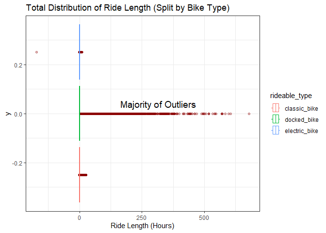
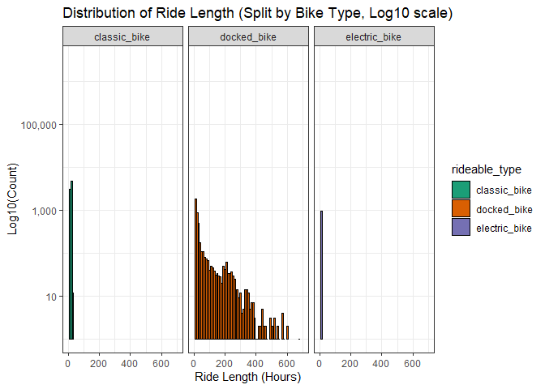
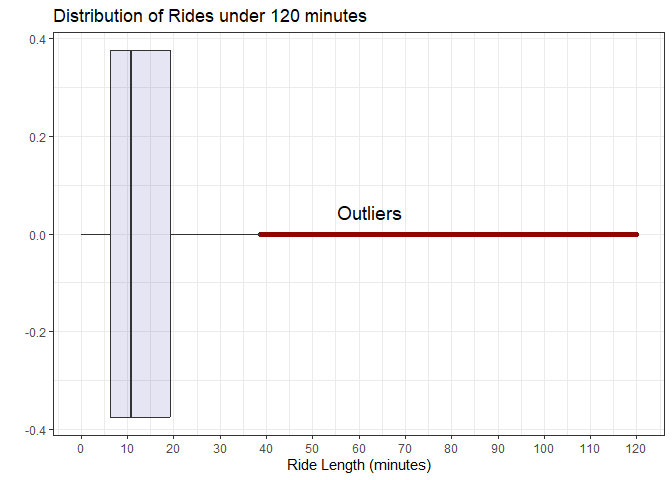
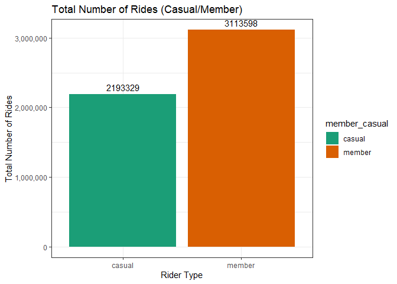
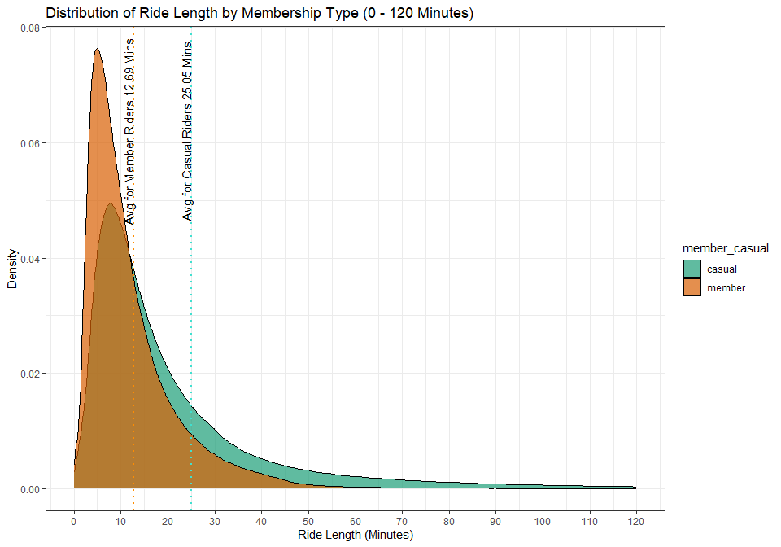
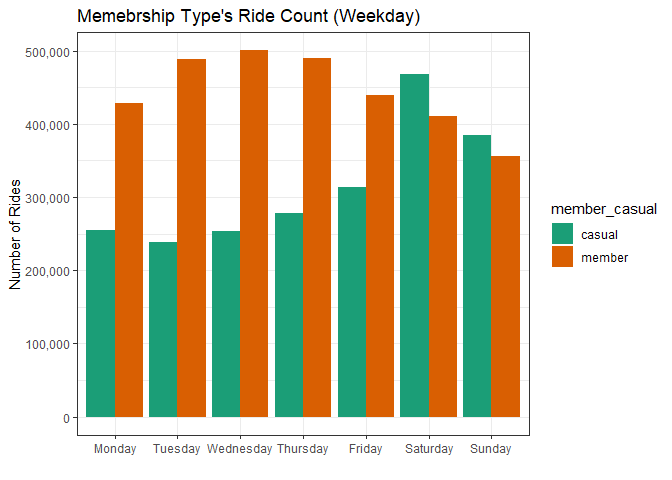
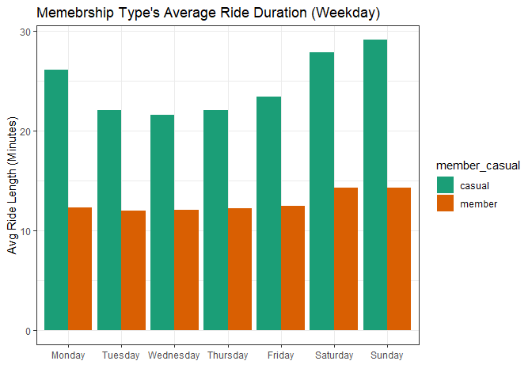
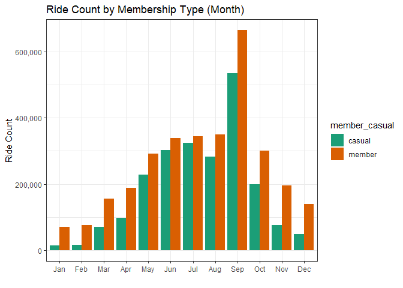
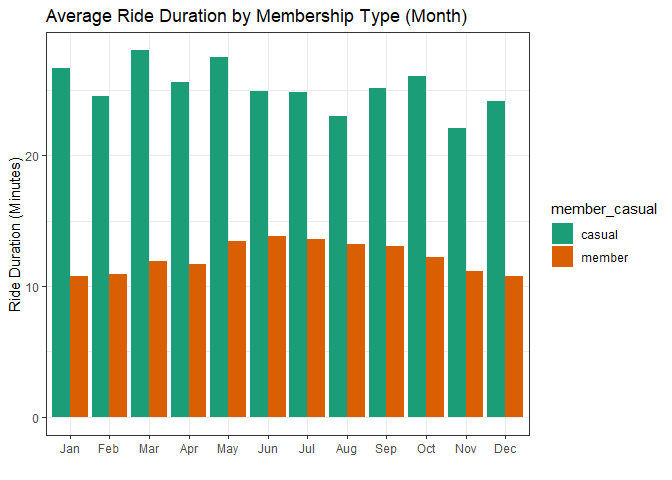

Cyclistic Bike-Share Case Study
================

# Introduction

The following is a case study using the data from a fictional company
named Cyclistic. This is part of the capstone project attained from the
Google Data Analytics Course with the goal to uncover insights into the
bike-sharing habits of Cyclistic’s riders. These insights will be used
to provide a marketing strategy based off data informed decisions.
Specifically, the analysis seeks to understand the differences in usage
patters between casual riders and members with the ultimate goal of
converting the former into subscribing members.

# Data Preparation

### Load Libraries

``` r
library(geosphere)
library(leaflet)
library(leaflet.extras)
library(knitr)
library(tidyverse)
```

    ## ── Attaching core tidyverse packages ──────────────────────── tidyverse 2.0.0 ──
    ## ✔ dplyr     1.1.1     ✔ readr     2.1.4
    ## ✔ forcats   1.0.0     ✔ stringr   1.5.0
    ## ✔ ggplot2   3.4.2     ✔ tibble    3.2.1
    ## ✔ lubridate 1.9.2     ✔ tidyr     1.3.0
    ## ✔ purrr     1.0.1     
    ## ── Conflicts ────────────────────────────────────────── tidyverse_conflicts() ──
    ## ✖ dplyr::filter() masks stats::filter()
    ## ✖ dplyr::lag()    masks stats::lag()
    ## ℹ Use the conflicted package (<http://conflicted.r-lib.org/>) to force all conflicts to become errors

``` r
theme_set(theme_bw())
```

### Import Data

Load all the trip files into a list.

``` r
triplist <- list.files(pattern = "*.csv")
triplist
```

    ##  [1] "202109-divvy-tripdata.csv" "202110-divvy-tripdata.csv"
    ##  [3] "202111-divvy-tripdata.csv" "202112-divvy-tripdata.csv"
    ##  [5] "202201-divvy-tripdata.csv" "202202-divvy-tripdata.csv"
    ##  [7] "202203-divvy-tripdata.csv" "202204-divvy-tripdata.csv"
    ##  [9] "202205-divvy-tripdata.csv" "202206-divvy-tripdata.csv"
    ## [11] "202207-divvy-tripdata.csv" "202208-divvy-tripdata.csv"
    ## [13] "202209-divvy-tripdata.csv"

Import the data.

``` r
all_trips <- map(triplist, ~read_csv(.x, show_col_types = F))
```

Evaluate the data structure before merging the list.

``` r
glimpse(all_trips)
```

Combining data into a single data frame.

``` r
all_trips <- bind_rows(all_trips)
```

### Verify Data Structure

Verify ride_id is a unique primary key.

``` r
anyDuplicated(all_trips$ride_id)
```

    ## [1] 0

Re-evaluate structure.

``` r
head(all_trips)
```

    ## # A tibble: 6 × 13
    ##   ride_id          rideable_type started_at          ended_at           
    ##   <chr>            <chr>         <dttm>              <dttm>             
    ## 1 9DC7B962304CBFD8 electric_bike 2021-09-28 16:07:10 2021-09-28 16:09:54
    ## 2 F930E2C6872D6B32 electric_bike 2021-09-28 14:24:51 2021-09-28 14:40:05
    ## 3 6EF72137900BB910 electric_bike 2021-09-28 00:20:16 2021-09-28 00:23:57
    ## 4 78D1DE133B3DBF55 electric_bike 2021-09-28 14:51:17 2021-09-28 15:00:06
    ## 5 E03D4ACDCAEF6E00 electric_bike 2021-09-28 09:53:12 2021-09-28 10:03:44
    ## 6 346DE323A2677DC0 electric_bike 2021-09-28 01:53:18 2021-09-28 02:00:02
    ## # ℹ 9 more variables: start_station_name <chr>, start_station_id <chr>,
    ## #   end_station_name <chr>, end_station_id <chr>, start_lat <dbl>,
    ## #   start_lng <dbl>, end_lat <dbl>, end_lng <dbl>, member_casual <chr>

``` r
summary(all_trips)
```

    ##    ride_id          rideable_type        started_at                    
    ##  Length:6584382     Length:6584382     Min.   :2021-09-01 00:00:06.00  
    ##  Class :character   Class :character   1st Qu.:2021-11-19 14:33:55.00  
    ##  Mode  :character   Mode  :character   Median :2022-05-22 22:19:21.00  
    ##                                        Mean   :2022-04-10 03:05:21.71  
    ##                                        3rd Qu.:2022-07-26 16:16:08.75  
    ##                                        Max.   :2022-09-30 23:59:56.00  
    ##                                                                        
    ##     ended_at                      start_station_name start_station_id  
    ##  Min.   :2021-09-01 00:00:41.00   Length:6584382     Length:6584382    
    ##  1st Qu.:2021-11-19 14:48:17.75   Class :character   Class :character  
    ##  Median :2022-05-22 22:50:51.00   Mode  :character   Mode  :character  
    ##  Mean   :2022-04-10 03:25:04.08                                        
    ##  3rd Qu.:2022-07-26 16:35:08.75                                        
    ##  Max.   :2022-10-05 19:53:11.00                                        
    ##                                                                        
    ##  end_station_name   end_station_id       start_lat       start_lng     
    ##  Length:6584382     Length:6584382     Min.   :41.64   Min.   :-87.84  
    ##  Class :character   Class :character   1st Qu.:41.88   1st Qu.:-87.66  
    ##  Mode  :character   Mode  :character   Median :41.90   Median :-87.64  
    ##                                        Mean   :41.90   Mean   :-87.65  
    ##                                        3rd Qu.:41.93   3rd Qu.:-87.63  
    ##                                        Max.   :45.64   Max.   :-73.80  
    ##                                                                        
    ##     end_lat         end_lng       member_casual     
    ##  Min.   :41.39   Min.   :-88.97   Length:6584382    
    ##  1st Qu.:41.88   1st Qu.:-87.66   Class :character  
    ##  Median :41.90   Median :-87.64   Mode  :character  
    ##  Mean   :41.90   Mean   :-87.65                     
    ##  3rd Qu.:41.93   3rd Qu.:-87.63                     
    ##  Max.   :42.37   Max.   :-87.30                     
    ##  NA's   :6439    NA's   :6439

``` r
str(all_trips)
```

    ## spc_tbl_ [6,584,382 × 13] (S3: spec_tbl_df/tbl_df/tbl/data.frame)
    ##  $ ride_id           : chr [1:6584382] "9DC7B962304CBFD8" "F930E2C6872D6B32" "6EF72137900BB910" "78D1DE133B3DBF55" ...
    ##  $ rideable_type     : chr [1:6584382] "electric_bike" "electric_bike" "electric_bike" "electric_bike" ...
    ##  $ started_at        : POSIXct[1:6584382], format: "2021-09-28 16:07:10" "2021-09-28 14:24:51" ...
    ##  $ ended_at          : POSIXct[1:6584382], format: "2021-09-28 16:09:54" "2021-09-28 14:40:05" ...
    ##  $ start_station_name: chr [1:6584382] NA NA NA NA ...
    ##  $ start_station_id  : chr [1:6584382] NA NA NA NA ...
    ##  $ end_station_name  : chr [1:6584382] NA NA NA NA ...
    ##  $ end_station_id    : chr [1:6584382] NA NA NA NA ...
    ##  $ start_lat         : num [1:6584382] 41.9 41.9 41.8 41.8 41.9 ...
    ##  $ start_lng         : num [1:6584382] -87.7 -87.6 -87.7 -87.7 -87.7 ...
    ##  $ end_lat           : num [1:6584382] 41.9 42 41.8 41.8 41.9 ...
    ##  $ end_lng           : num [1:6584382] -87.7 -87.7 -87.7 -87.7 -87.7 ...
    ##  $ member_casual     : chr [1:6584382] "casual" "casual" "casual" "casual" ...
    ##  - attr(*, "spec")=
    ##   .. cols(
    ##   ..   ride_id = col_character(),
    ##   ..   rideable_type = col_character(),
    ##   ..   started_at = col_datetime(format = ""),
    ##   ..   ended_at = col_datetime(format = ""),
    ##   ..   start_station_name = col_character(),
    ##   ..   start_station_id = col_character(),
    ##   ..   end_station_name = col_character(),
    ##   ..   end_station_id = col_character(),
    ##   ..   start_lat = col_double(),
    ##   ..   start_lng = col_double(),
    ##   ..   end_lat = col_double(),
    ##   ..   end_lng = col_double(),
    ##   ..   member_casual = col_character()
    ##   .. )
    ##  - attr(*, "problems")=<externalptr>

# Data Wrangling

Extrapolation of dates.

``` r
all_trips$date <- as.Date(all_trips$started_at)
all_trips$weekday <- weekdays(all_trips$started_at)
all_trips$month <- month(all_trips$started_at, label = T)
all_trips$year <- year(all_trips$started_at)
```

Convert weekday into a factor, ensuring days are analyzed in a logical
sequence rather than alphabetically.

``` r
all_trips$weekday <- ordered(all_trips$weekday,
                             levels = c("Monday","Tuesday","Wednesday","Thursday","Friday","Saturday","Sunday"))
```

Verify the class of our weekday variable.

``` r
class(all_trips$weekday)
```

    ## [1] "ordered" "factor"

Calculate ride length.

``` r
all_trips$ride_length_sec <- difftime(all_trips$ended_at, all_trips$started_at)
```

Convert ride_length_sec to numeric format

``` r
all_trips$ride_length_sec <- as.numeric(all_trips$ride_length_sec)
```

### Addressing Missing Station Names

Identify the number of NA values in the dataset.

``` r
colSums(is.na(all_trips))
```

    ##            ride_id      rideable_type         started_at           ended_at 
    ##                  0                  0                  0                  0 
    ## start_station_name   start_station_id   end_station_name     end_station_id 
    ##             988145             988143            1057488            1057488 
    ##          start_lat          start_lng            end_lat            end_lng 
    ##                  0                  0               6439               6439 
    ##      member_casual               date            weekday              month 
    ##                  0                  0                  0                  0 
    ##               year    ride_length_sec 
    ##                  0                  0

Create two station lists (start stations and end stations)

``` r
start_station_list <- all_trips %>%
  filter(!is.na(start_station_name)) %>% 
  distinct(start_station_id, start_lat, start_lng, .keep_all = T) %>%
  select(station_id = start_station_id,
         station_name = start_station_name,
         lat = start_lat,
         lng = start_lng)

end_station_list <- all_trips %>%
  filter(!is.na(end_station_name)) %>% 
  distinct(end_station_id, end_lat, end_lng, .keep_all = T) %>% 
  select(station_id = end_station_id,
         station_name = end_station_name,
         lat = end_lat,
         lng = end_lng)
```

Vertically bind rows to create one station list

``` r
full_station_list <- bind_rows(start_station_list, end_station_list)
```

Filter stations where multiple station ids are associated with the same
set of coordinates. Due to non-standardized naming conventions, some
station names contain prefixes or variations of the same name. Station
ids are not associated with different station names, just variations of
the same name. In order to avoid a ‘many-to-many’ relationship error,
the first instance is used in our new list.

``` r
full_station_list <- full_station_list %>% 
  group_by(lat, lng) %>% 
  filter(n_distinct(station_id) == 1) %>% 
  summarize(station_id = first(station_id),
            station_name = first(station_name)) %>% 
  ungroup()
```

Join to our main data frame (all_trips) with our new station list.

``` r
all_trips2 <- left_join(all_trips, full_station_list,
                        by = c("start_lat" = "lat",
                               "start_lng" = "lng"))
```

Move over recovered start station names and id’s.

``` r
all_trips2 <- all_trips2 %>%
  mutate(start_station_name = coalesce(start_station_name, station_name),
         start_station_id = coalesce(start_station_id, station_id)) %>% 
  select(-station_name, -station_id)
```

Do the same for the end station name’s and id’s.

``` r
all_trips2 <- left_join(all_trips2, full_station_list,
                        by = c("end_lat" = "lat", "end_lng" = "lng"))

all_trips2 <- all_trips2 %>% 
  mutate(end_station_name = coalesce(end_station_name, station_name),
         end_station_id = coalesce(end_station_id, station_id)) %>% 
  select(-station_name, -station_id)
```

Recovered a couple hundred thousand station names and id’s. Process was
limited due to clustering of station coordinates.

``` r
print(colSums(is.na(all_trips)))
```

    ##            ride_id      rideable_type         started_at           ended_at 
    ##                  0                  0                  0                  0 
    ## start_station_name   start_station_id   end_station_name     end_station_id 
    ##             988145             988143            1057488            1057488 
    ##          start_lat          start_lng            end_lat            end_lng 
    ##                  0                  0               6439               6439 
    ##      member_casual               date            weekday              month 
    ##                  0                  0                  0                  0 
    ##               year    ride_length_sec 
    ##                  0                  0

``` r
print(colSums(is.na(all_trips2)))
```

    ##            ride_id      rideable_type         started_at           ended_at 
    ##                  0                  0                  0                  0 
    ## start_station_name   start_station_id   end_station_name     end_station_id 
    ##             759720             759718             817437             817437 
    ##          start_lat          start_lng            end_lat            end_lng 
    ##                  0                  0               6439               6439 
    ##      member_casual               date            weekday              month 
    ##                  0                  0                  0                  0 
    ##               year    ride_length_sec 
    ##                  0                  0

### Identifying Extreme Outliers

Calculate the distance using the Haversine formula (Output is in
meters). This is euclidean distance and is not a reflection of of road
network distance.

``` r
all_trips2 <- all_trips2 %>%
  rowwise() %>% 
  mutate(geo_distance_meters = distHaversine(c(start_lng, start_lat), c(end_lng, end_lat)))
```

Distribution of ride length.

``` r
summary(all_trips2$ride_length_sec)
```

    ##    Min. 1st Qu.  Median    Mean 3rd Qu.    Max. 
    ## -621201     362     640    1182    1150 2442301

In-depth view considering there is such a large gap in the 4th quartile.
Calculate percentiles for ride length in groups of 0.05.

``` r
fourth_quar_ride_length <- quantile(all_trips2$ride_length_sec, probs = c(.80, .85, .90, .95, .99, .998, .999, 1))
fourth_quar_ride_length
```

    ##        80%        85%        90%        95%        99%      99.8%      99.9% 
    ##    1335.00    1589.00    1981.00    2811.00    6611.00   18122.24   67331.67 
    ##       100% 
    ## 2442301.00

The distribution is vast with great extremes, with a majority of
outliers associated with the docked bikes. Perhaps this is an indication
of an error occurring with docked bikes.

``` r
ggplot(all_trips2, aes(x = ride_length_sec/3600, color = rideable_type)) +
  geom_boxplot(outlier.color = "darkred", alpha = 0.3) +
  labs(title = "Total Distribution of Ride Length (Split by Bike Type)",
       x = "Ride Length (Hours)") +
  annotate("Text", x = 312, y = 0.04, label = " Majority of Outliers", size = 5)
```

<!-- -->

Most trips fall within a few hours or less, with the exception of docked
bikes.

``` r
ggplot(all_trips2, aes(x = ride_length_sec/3600, fill = rideable_type)) +
  geom_histogram(binwidth = 10, color = "black") +
  labs(title = "Distribution of Ride Length (Split by Bike Type, Log10 scale)",
       x = "Ride Length (Hours)",
       y = "Log10(Count)") +
  scale_y_log10(labels = scales::comma_format()) + 
  xlim(0, 700) +
  facet_wrap(~rideable_type) +
  scale_fill_brewer(palette = "Dark2")
```

<!-- -->

Filter and examine erroneous data.

``` r
invalid_trips <- all_trips2 %>% 
  filter((ride_length_sec <= 0 |
            (geo_distance_meters == 0 & ride_length_sec <= 60)) |
           start_station_name == "Pawel Bialowas - Test- PBSC charging station")
```

After review, remove NA values and erroneous trips.

``` r
all_trips3 <- all_trips2 %>%
  na.omit() %>%
  anti_join(invalid_trips, by = "ride_id")
```

# Analysis

Create a station list to have one set of coordinates per station.

``` r
map_station_list <- full_station_list %>% 
  distinct(station_id, station_name, .keep_all = T)
```

Create a cluster leaflet map. Leaflet code is provided in .R file
(Screenshot was provided for compatibility) 

### General Overview

Total number of rides exceeds 5 million trips (Excluding NA values and
those defined as erroneous). The substantial difference between the 95th
and 99th percentile indicates a small portion of rides are significantly
longer than most rides. Shortest ride is 1 second, with the longest
being approximately 678 hours. The high standard deviation compared to
the average length indicates a notable range in ride length.

``` r
general_summary <- all_trips3 %>%
  group_by() %>%
  summarize("Total Number of Rides" = n(),
            "Shortest Ride Length (Seconds)" = min(ride_length_sec),
            "Median Ride Length (Minutes)" = median(ride_length_sec/60),
            "Average Ride Length (Minutes)" = mean(ride_length_sec/60),
            "Longest Ride Length (Minutes)" = max(ride_length_sec/60),
            "Standard Deviation (Minutes)" = sd(ride_length_sec/60),
            "Interquartile Range (Minutes)" = IQR(ride_length_sec/60),
            "95th Percentile of Ride Length (Minutes)" = quantile(ride_length_sec/60, probs = 0.95),
            "99th Percentile of Ride Length (Minutes)" = quantile(ride_length_sec/60, probs = 0.99),
            "Average Ride Distance (Euclidean) (Miles)" = mean(geo_distance_meters*.00062137),
            "Longest Ride Distance (Euclidean) (Miles)" = max(geo_distance_meters*.00062137))
kable(general_summary, format = "markdown")
```

| Total Number of Rides | Shortest Ride Length (Seconds) | Median Ride Length (Minutes) | Average Ride Length (Minutes) | Longest Ride Length (Minutes) | Standard Deviation (Minutes) | Interquartile Range (Minutes) | 95th Percentile of Ride Length (Minutes) | 99th Percentile of Ride Length (Minutes) | Average Ride Distance (Euclidean) (Miles) | Longest Ride Distance (Euclidean) (Miles) |
|----------------------:|-------------------------------:|-----------------------------:|------------------------------:|------------------------------:|-----------------------------:|------------------------------:|-----------------------------------------:|-----------------------------------------:|------------------------------------------:|------------------------------------------:|
|               5306927 |                              1 |                     10.98333 |                      17.82178 |                      40705.02 |                     70.73164 |                      13.26667 |                                 48.41667 |                                 110.8667 |                                  1.330376 |                                  19.09207 |

A general re-examination of the distribution of ride length (Limited to
120 Minutes). IQR is 13.27 minutes suggesting the middle 50% of ride
lengths are relatively close to the median.

``` r
ggplot(all_trips3, aes(x = ride_length_sec/60)) +
  geom_boxplot(fill = "darkblue", outlier.color = "darkred", alpha = 0.1) +
  labs(title = "Distribution of Rides under 120 minutes",
       x = "Ride Length (minutes)",
       y = "") +
  annotate("Text", x = 62.5, y = 0.045, label = "Outliers", size = 5) +
  scale_x_continuous(breaks = seq(0, 120, by = 10), limits = c(0, 120))
```

<!-- -->

### Member Overview

Members statistics Significantly higher standard deviation for casual
riders suggests that there is more variability in their ride lengths.

``` r
member_summary <- all_trips3 %>%
  group_by(member_casual) %>%
  summarize(
    "Total Number of Rides" = n(),
    "Shortest Ride Length (Seconds)" = min(ride_length_sec),
    "Median Ride Length (Minutes)" = median(ride_length_sec / 60),
    "Average Ride Length (Minutes)" = mean(ride_length_sec / 60),
    "Longest Ride Length (Minutes)" = max(ride_length_sec / 60),
    "Standard Deviation (Minutes)" = sd(ride_length_sec / 60),
    "Interquartile Range (Minutes)" = IQR(ride_length_sec / 60),
    "95th Percentile of Ride Length (Minutes)" = quantile(ride_length_sec / 60, probs = 0.95),
    "99th Percentile of Ride Length (Minutes)" = quantile(ride_length_sec / 60, probs = 0.99),
    "Average Ride Distance (Euclidean) (Miles)" = mean(geo_distance_meters * .00062137),
    "Longest Ride Distance (Euclidean) (Miles)" = max(geo_distance_meters * .00062137)) %>%
  ungroup()
kable(member_summary, format = "markdown")
```

| member_casual | Total Number of Rides | Shortest Ride Length (Seconds) | Median Ride Length (Minutes) | Average Ride Length (Minutes) | Longest Ride Length (Minutes) | Standard Deviation (Minutes) | Interquartile Range (Minutes) | 95th Percentile of Ride Length (Minutes) | 99th Percentile of Ride Length (Minutes) | Average Ride Distance (Euclidean) (Miles) | Longest Ride Distance (Euclidean) (Miles) |
|:--------------|----------------------:|-------------------------------:|-----------------------------:|------------------------------:|------------------------------:|-----------------------------:|------------------------------:|-----------------------------------------:|-----------------------------------------:|------------------------------------------:|------------------------------------------:|
| casual        |               2193329 |                              1 |                    14.383333 |                      25.10914 |                      40705.02 |                    107.38389 |                      18.16667 |                                 74.75000 |                                151.93333 |                                  1.374461 |                                  19.09207 |
| member        |               3113598 |                              1 |                     9.216667 |                      12.68831 |                       1499.90 |                     18.45028 |                      10.25000 |                                 33.03333 |                                 50.93333 |                                  1.299321 |                                  17.22738 |

Total number of rides between Members and casual riders. Non-members
consist of 41% of the rides.

``` r
ggplot(member_summary, aes(x = member_casual, y = `Total Number of Rides`, fill = member_casual)) +
  geom_col() +
  geom_text(aes(label = `Total Number of Rides`), vjust = -0.5, size = 4) +
  labs(title = "Total Number of Rides (Casual/Member)",
       x = "Rider Type",
       y = "Total Number of Rides") +
  scale_y_continuous(labels = scales::comma_format()) +
  scale_fill_brewer(palette = "Dark2")
```

<!-- -->

Distribution of ride length Non-members average ride duration is twice
as long as members despite members using the service more frequently.

``` r
ggplot(all_trips3, aes(x = ride_length_sec / 60, fill = member_casual)) +
  geom_density(alpha = 0.7) +
  geom_vline(xintercept = 12.69740, linetype = "dotted", color = "darkorange", size = 0.85) +
  geom_vline(xintercept = 25.05755, linetype = "dotted", color = "turquoise", size = 0.85) +
  annotate("text", x = 11.5, y = 0.062, label = "Avg for Member Riders 12.69 Mins", angle = 90) +
  annotate("text", x = 23.8, y = 0.062, label = "Avg for Casual Riders 25.05 Mins", angle = 90) +
  labs(title = "Distribution of Ride Length by Membership Type (0 - 120 Minutes)",
       x = "Ride Length (Minutes)",
       y = "Density") +
  scale_x_continuous(breaks = seq(0, 120, by = 10), limits = c(0, 120)) +
  scale_fill_brewer(palette = "Dark2")
```

<!-- -->

### Weekday Rider Behavior

The 95th and 99th percentile of ride length from casual riders are
consistently 2-3 times longer than those from members.

``` r
weekday_summary <- all_trips3 %>%
  group_by(weekday, member_casual) %>%
  summarize("Total Number of Rides" = n(),
            "Shortest Ride Length (Seconds)" = min(ride_length_sec),
            "Median Ride Length (Minutes)" = median(ride_length_sec/60),
            "Average Ride Length (Minutes)" = mean(ride_length_sec/60),
            "Longest Ride Length (Minutes)" = max(ride_length_sec/60),
            "Standard Deviation (Minutes)" = sd(ride_length_sec/60),
            "Interquartile Range (Minutes)" = IQR(ride_length_sec/60),
            "95th Percentile of Ride Length (Minutes)" = quantile(ride_length_sec/60, probs = 0.95),
            "99th Percentile of Ride Length (Minutes)" = quantile(ride_length_sec/60, probs = 0.99),
            "Average Ride Distance (Euclidean) (Miles)" = mean(geo_distance_meters*.00062137),
            "Longest Ride Distance (Euclidean) (Miles)" = max(geo_distance_meters*.00062137))
kable(weekday_summary, format = "markdown")
```

| weekday   | member_casual | Total Number of Rides | Shortest Ride Length (Seconds) | Median Ride Length (Minutes) | Average Ride Length (Minutes) | Longest Ride Length (Minutes) | Standard Deviation (Minutes) | Interquartile Range (Minutes) | 95th Percentile of Ride Length (Minutes) | 99th Percentile of Ride Length (Minutes) | Average Ride Distance (Euclidean) (Miles) | Longest Ride Distance (Euclidean) (Miles) |
|:----------|:--------------|----------------------:|-------------------------------:|-----------------------------:|------------------------------:|------------------------------:|-----------------------------:|------------------------------:|-----------------------------------------:|-----------------------------------------:|------------------------------------------:|------------------------------------------:|
| Monday    | casual        |                255140 |                              1 |                    14.466667 |                      26.08783 |                     32035.450 |                    114.39662 |                     19.420833 |                                 79.23333 |                                156.03333 |                                  1.321632 |                                  18.09359 |
| Monday    | member        |                428693 |                              1 |                     8.850000 |                      12.28598 |                      1499.900 |                     17.65396 |                      9.883333 |                                 32.50000 |                                 49.58333 |                                  1.273410 |                                  15.69781 |
| Tuesday   | casual        |                238510 |                              1 |                    12.533333 |                      22.02389 |                     15482.967 |                     66.93481 |                     15.300000 |                                 66.67583 |                                141.78183 |                                  1.321454 |                                  17.44008 |
| Tuesday   | member        |                488257 |                              1 |                     8.766667 |                      11.97210 |                      1499.900 |                     18.35076 |                      9.483333 |                                 30.83333 |                                 46.40000 |                                  1.278701 |                                  14.51286 |
| Wednesday | casual        |                253820 |                              1 |                    12.533333 |                      21.56668 |                     30400.550 |                     96.91839 |                     14.800000 |                                 62.81667 |                                137.60400 |                                  1.328562 |                                  16.21545 |
| Wednesday | member        |                500360 |                              1 |                     8.933333 |                      12.06528 |                      1471.283 |                     17.09959 |                      9.633333 |                                 31.06667 |                                 46.68333 |                                  1.290105 |                                  15.34590 |
| Thursday  | casual        |                278348 |                              1 |                    12.700000 |                      22.04268 |                     27082.800 |                    107.63596 |                     15.100000 |                                 64.40000 |                                138.32550 |                                  1.346618 |                                  18.28214 |
| Thursday  | member        |                490641 |                              1 |                     8.950000 |                      12.19189 |                      1475.633 |                     17.95918 |                      9.733333 |                                 31.26667 |                                 47.66667 |                                  1.290537 |                                  16.17534 |
| Friday    | casual        |                314419 |                              1 |                    13.616667 |                      23.37812 |                     22629.900 |                     92.36085 |                     16.566667 |                                 67.70167 |                                143.44700 |                                  1.353130 |                                  18.77765 |
| Friday    | member        |                439661 |                              1 |                     9.066667 |                      12.43543 |                      1455.300 |                     17.87896 |                      9.950000 |                                 32.20000 |                                 49.61667 |                                  1.274871 |                                  17.22738 |
| Saturday  | casual        |                468269 |                              1 |                    16.516667 |                      27.79848 |                     40705.017 |                    116.84522 |                     20.550000 |                                 81.36667 |                                159.12200 |                                  1.449862 |                                  18.46617 |
| Saturday  | member        |                410355 |                              1 |                    10.333333 |                      14.23713 |                      1499.817 |                     20.34065 |                     11.816667 |                                 36.76667 |                                 58.93333 |                                  1.362615 |                                  15.69113 |
| Sunday    | casual        |                384823 |                              1 |                    16.800000 |                      29.06882 |                     32858.533 |                    126.74079 |                     21.400000 |                                 85.55000 |                                166.34633 |                                  1.418429 |                                  19.09207 |
| Sunday    | member        |                355631 |                              1 |                    10.133333 |                      14.24353 |                      1476.700 |                     20.15757 |                     11.950000 |                                 37.40000 |                                 60.06667 |                                  1.341141 |                                  15.68632 |

Total number of rides by weekday Casual ride count goes up throughout
the week (peaking on Saturday). Member rides slightly decrease
throughout the week, reaching a low point on Sunday.

``` r
ggplot(weekday_summary, aes(x = weekday, y = `Total Number of Rides`, fill = member_casual)) +
  geom_col(position = "dodge") +
  labs(title = "Memebrship Type's Ride Count (Weekday)",
       x = "",
       y = "Number of Rides") +
  scale_y_continuous(labels = scales::comma_format()) +
  scale_fill_brewer(palette = "Dark2")
```

<!-- -->

Average ride duration by member type (Weekday). Casual rides tend to
have longer rides on the weekends suggesting they may be using the
service for leisure. Member rides are consistently shorter which may
suggest they are using the service for commuting.

``` r
ggplot(weekday_summary, aes(x = weekday, y = `Average Ride Length (Minutes)`, fill = member_casual)) +
  geom_col(position = "dodge") +
  labs(title = "Memebrship Type's Average Ride Duration (Weekday)",
       x = "",
       y = "Avg Ride Length (Minutes)") +
  scale_fill_brewer(palette = "Dark2")
```

<!-- -->

### Monthly Rider Behavior

Shortest ride length remains at 1 second throughout the year, suggesting
there is a consistent recording error. IQR is higher during the warmer
months 99th percentile are higher during the warmer months Its clear
rider activity is influenced by the weather.

``` r
month_summary <- all_trips3 %>%
  group_by(month) %>%
  summarize("Total Number of Rides" = n(),
            "Shortest Ride Length (Seconds)" = min(ride_length_sec),
            "Median Ride Length (Minutes)" = median(ride_length_sec/60),
            "Average Ride Length (Minutes)" = mean(ride_length_sec/60),
            "Longest Ride Length (Minutes)" = max(ride_length_sec/60),
            "Standard Deviation (Minutes)" = sd(ride_length_sec/60),
            "Interquartile Range (Minutes)" = IQR(ride_length_sec/60),
            "95th Percentile of Ride Length (Minutes)" = quantile(ride_length_sec/60, probs = 0.95),
            "99th Percentile of Ride Length (Minutes)" = quantile(ride_length_sec/60, probs = 0.99),
            "Average Ride Distance (Euclidean) (Miles)" = mean(geo_distance_meters*.00062137),
            "Longest Ride Distance (Euclidean) (Miles)" = max(geo_distance_meters*.00062137))
kable(month_summary, format = "markdown")
```

| month | Total Number of Rides | Shortest Ride Length (Seconds) | Median Ride Length (Minutes) | Average Ride Length (Minutes) | Longest Ride Length (Minutes) | Standard Deviation (Minutes) | Interquartile Range (Minutes) | 95th Percentile of Ride Length (Minutes) | 99th Percentile of Ride Length (Minutes) | Average Ride Distance (Euclidean) (Miles) | Longest Ride Distance (Euclidean) (Miles) |
|:------|----------------------:|-------------------------------:|-----------------------------:|------------------------------:|------------------------------:|-----------------------------:|------------------------------:|-----------------------------------------:|-----------------------------------------:|------------------------------------------:|------------------------------------------:|
| Jan   |                 83715 |                              1 |                     7.900000 |                      13.36719 |                     29271.100 |                    158.50747 |                      8.383333 |                                 29.86667 |                                  59.3930 |                                  1.082389 |                                  14.47081 |
| Feb   |                 92634 |                              1 |                     8.183333 |                      13.30118 |                     10905.967 |                     63.22679 |                      8.900000 |                                 32.70000 |                                  75.0835 |                                  1.124016 |                                  15.36477 |
| Mar   |                225595 |                              1 |                     9.833333 |                      16.95908 |                     34354.067 |                     95.12715 |                     12.358333 |                                 45.36667 |                                 101.9177 |                                  1.265130 |                                  18.49652 |
| Apr   |                285724 |                              1 |                     9.950000 |                      16.41181 |                      7545.967 |                     37.47266 |                     12.333333 |                                 45.35000 |                                 103.4795 |                                  1.273946 |                                  13.45942 |
| May   |                519961 |                              1 |                    12.050000 |                      19.57779 |                     10722.967 |                     38.56548 |                     15.183333 |                                 56.48333 |                                 122.1667 |                                  1.364573 |                                  19.09207 |
| Jun   |                640354 |                              1 |                    12.183333 |                      19.01666 |                      6672.867 |                     33.71272 |                     14.400000 |                                 52.45000 |                                 118.5500 |                                  1.386174 |                                  18.77765 |
| Jul   |                668866 |                              1 |                    12.016667 |                      19.04304 |                     32035.450 |                     53.54836 |                     14.516667 |                                 54.08333 |                                 119.0167 |                                  1.382160 |                                  18.46617 |
| Aug   |                632268 |                              1 |                    11.250000 |                      17.57437 |                      4848.350 |                     30.46040 |                     13.250000 |                                 48.65000 |                                 110.3777 |                                  1.364890 |                                  18.09359 |
| Sep   |               1200467 |                              1 |                    11.383333 |                      18.44625 |                     32858.533 |                     82.57002 |                     13.483333 |                                 49.73333 |                                 113.9333 |                                  1.358246 |                                  18.34415 |
| Oct   |                499464 |                              1 |                    10.700000 |                      17.73243 |                     40705.017 |                     96.94723 |                     12.666667 |                                 46.11667 |                                 107.0062 |                                  1.307473 |                                  17.98713 |
| Nov   |                270286 |                              1 |                     8.933333 |                      14.18004 |                     22279.733 |                     80.47272 |                      9.966667 |                                 35.96667 |                                  76.8525 |                                  1.203757 |                                  15.44276 |
| Dec   |                187593 |                              1 |                     8.666667 |                      14.24932 |                     30400.550 |                    126.14195 |                      9.583333 |                                 34.21667 |                                  73.2000 |                                  1.186192 |                                  14.01142 |

Plot monthly ride count by membership type The amount of rides drop
significantly in the winter months, peaking in September. During the
slower months it appears members ride twice as much as casual riders.

``` r
all_trips3 %>% 
  group_by(month, member_casual) %>% 
  summarize("Number of Rides" = n()) %>% 
  ggplot(aes(x = month, y = `Number of Rides`, fill = member_casual)) +
  geom_col(position = "dodge") +
  labs(title = "Ride Count by Membership Type (Month)",
       x = "",
       y = "Ride Count") +
  scale_y_continuous(labels = scales::comma_format()) +
  scale_fill_brewer(palette = "Dark2")
```

<!-- -->

Plot monthly average ride by membership type Casual riders trip length
are about twice as long as members. This is consistent throughout the
year.

``` r
all_trips3 %>%
  group_by(month, member_casual) %>%
  summarize(average_duration = mean(ride_length_sec/60)) %>%
  ggplot(aes(x = month, y = average_duration, fill = member_casual)) +
  geom_col(position = "dodge") + 
  labs(title = "Average Ride Duration by Membership Type (Month)",
       x = "", 
       y = "Ride Duration (Minutes)") +
  scale_fill_brewer(palette = "Dark2")
```

<!-- -->

# Conclusion

### Summary of Findings

The analysis reveals key differences between casual riders and annual
members. Casual riders tend to ride for longer times and on weekends
when compared to annual members. This is particularly apparent in the
warmer months, suggesting casual riders are using the service for
recreational use as opposed to commuting. When cultivating a marketing
plan to appeal to casual riders these clear differences in motivation
should be considered. With an emphasis on converting riders already
using our service, the following can be implemented.

### Recommendations

1.  Introduce flexible membership options that would cater towards
    current casual riders. A tier membership system that would allow for
    weekend riders to subscribe to “Weekend-only” or “Summer-Passes”
    could be more appealing.
2.  Introducing a tracking system that allows riders to track distance
    and time themselves could “gamify” the experience. Its clear casual
    riders seek out longer rides, so the ability to share notable
    achievements would not only bring a natural sense of competition but
    a sense of community in our riders.
3.  We can further encourage a sense of community by rewarding casual
    riders who use Social Media to engage with our service. This can be
    done with promotional prices or free weekend trials for those who
    participate.
4.  Launch targeted marketing campaigns during seasonal peak times that
    promote weekend sales and memberships.
